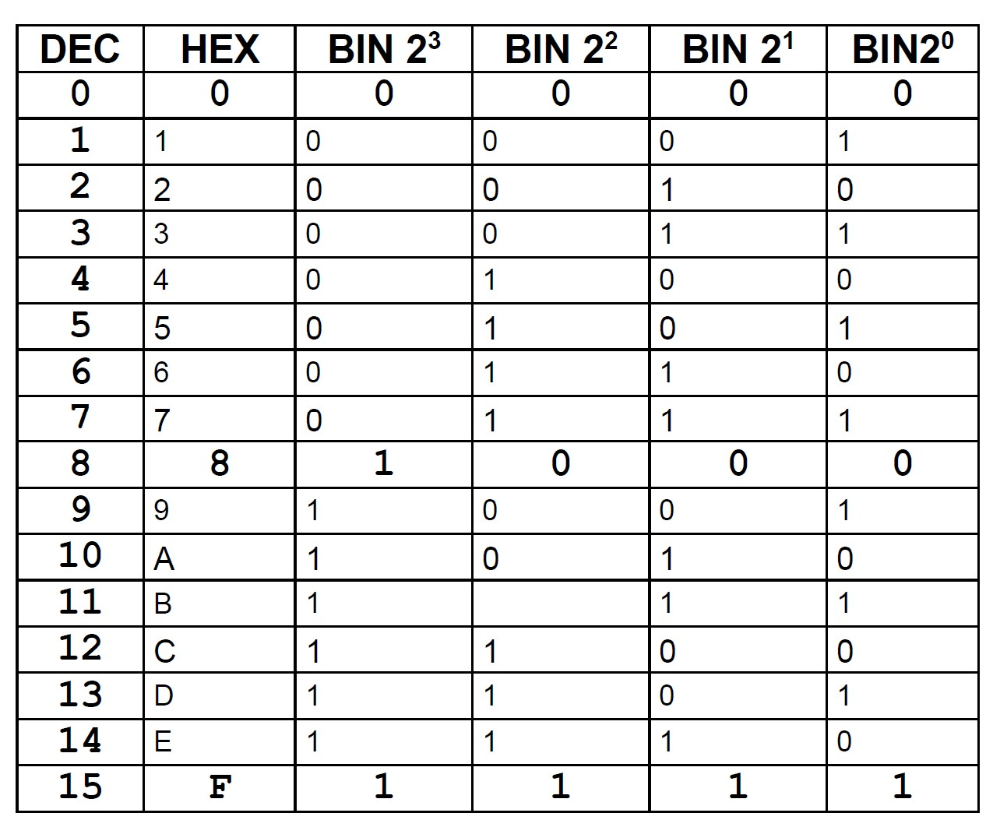

#### 1.

#### 2.

11'1000'1111

#### 3.

182

#### 4.

E2A5

#### 5.

0100'1110

#### 6.

a. Decimal: 192.168.76.211, Hex: C0.A8.4C.D3

b. Decimal: 190.131.133.213.228.254, Hex: BE.83.85.D5.E4.FE

#### 8.

2^7 or 7 bits

#### 11.

##### a. (unsigned)

Smallest: 0

Largest: 255

##### b. (signed)

Smallest: -128

Largest: 127

##### c.

01010011

##### d.

10101101

##### e.

Result: 00000000

##### f.

Binary value: 00000000

##### g.

The value range for signed ints (-128 - 127) does not hold enough space for 150, which is out of that range.
